# Prepare Your Environment

## Introduction

This lab walks you through the steps necessary to create a proper operating environment.  We will take advantage of the OCI Resource Manager to create the environment. Resource Manager is an Oracle Cloud Infrastructure service that allows you to automate the process of provisioning your Oracle Cloud Infrastructure resources.  We will be using the stack feature along with Terraform scripts created on your behalf.  As part of the stack we will set up functions, the virtual cloud network, and some data sources.  We will use these in later labs.

Estimated Time: 13 minutes

### Objectives

In this lab you will:
* Create a compartment
* Create API Key and Authorization tokens
* Perform a stack deployment
* Configure your cloud shell for Functions

### Prerequisites

This lab assumes you have:

* An Oracle Free Tier, Always Free, or Paid Account


## Task 1: Create a Compartment

1. Log into the OCI console using your tenancy.  Please make note of what region you are at.

    

2. On left side drop down (left of Oracle Cloud banner), go to Identity & Security and then Compartments.

    

3. Click on Create Compartment. This opens up a new window.

  Enter **demonosql** as compartment name, enter a description and hit 'Create Compartment' button at bottom of window.  The parent compartment will display your current parent compartment -- this does not need to be changed.

    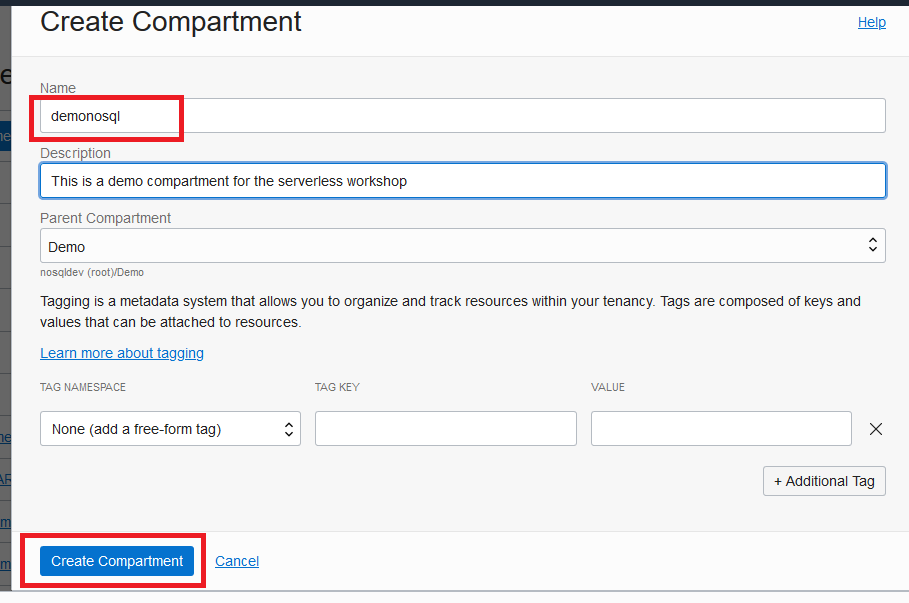


## Task 2: Create an API Key and Auth Token For Your User

1. Top right, click on your Profile -> User Settings.

  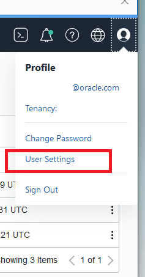

2. On the left, click on 'Auth Tokens'. Click on Generate Token.

    

  Provide a description and then hit Generate Token.

    

  This will generate a token. **Make sure to copy the token and save it for future steps**.  There is a copy button you can use.  Paste it into notepad, some text file, etc. for use later.

3. Go back to your profile and click 'User Settings' again. Copy your OCID

    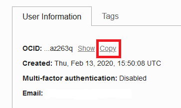

4. Open the Cloud Shell in the top right menu.  It can take about 2 minutes to get the Cloud Shell started.  

    

  **Note:** This needs to be executed in the **HOME region**.  Please ensure you are in your home region.  The Cloud Shell prompt shows you what region the shell is running out of.

    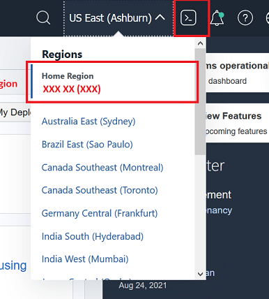

5. Execute these commands in your Cloud Shell.  Replace "YOURUSEROCID" with your OCID you copied above before executing.

    ````
    <copy>
    openssl genrsa -out NoSQLLabPrivateKey.pem  4096        
    openssl rsa -pubout -in NoSQLLabPrivateKey.pem -out NoSQLLabPublicKey.pem
    oci iam user api-key upload --user-id YOURUSEROCID --key-file NoSQLLabPublicKey.pem > info.json
    </copy>
    ````
    If you execute the 'oci iam' command before replacing "YOURUSEROCID" then you will get the following error:
    **"Authorization failed or requested resource not found".**   Replace "YOURUSEROCID" and try the last command again.    

## Task 3: Deploy the PoC Application

1. To deploy the application, we will use a terraform scripts provided for this Lab. Click on the 'Deploy to Oracle Cloud ' button.  This will create a new window in your browser.  {MJB: NEED TO DEPLOY FROM OBJECT STORAGE}

  [](https://cloud.oracle.com/resourcemanager/stacks/create?region=us-phoenix-1&zipUrl=https://github.com/dario-vega/serverless-with-nosql-database/archive/refs/heads/main.zip)

  Oracle NoSQL Always Free tables are available only in the Phoenix region.  This application will be deployed in the Phoenix Region and if you are not subscribed to that region you will get the following error.  If you are subscribed, then proceed to step 2.

    

  Please subscribe to Phoenix Region.  Click on drop down by your region and click on 'Manage Regions'.

    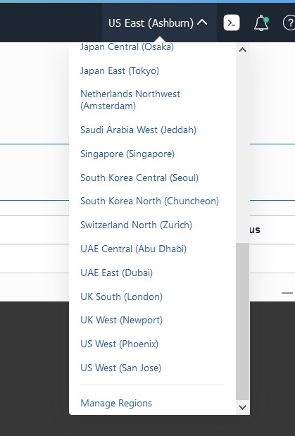

  This will bring up a list of regions.  Look for Phoenix and hit 'Subscribe'.

    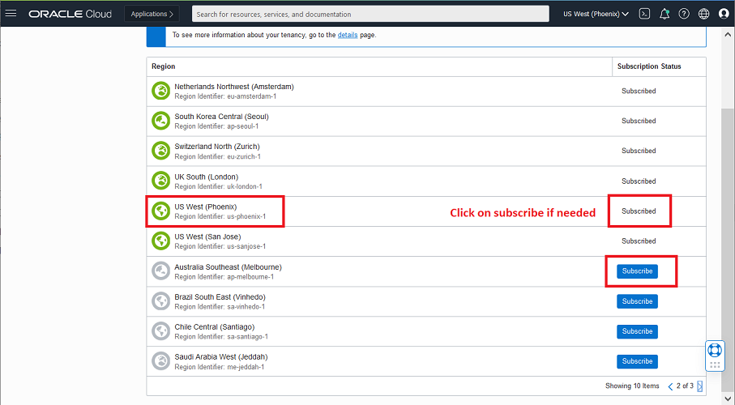

2. After successfully hitting the 'Deploy to Oracle Cloud' button, you will be brought to a new screen.

    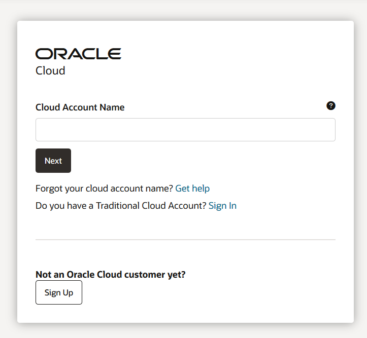


3. Provide your **Cloud Account Name** (tenancy name, not your username or email) and click on Next.

  Log into your account using your credentials (system may have remembered this from a prior log in).  You will see the Create Stack screen below:

    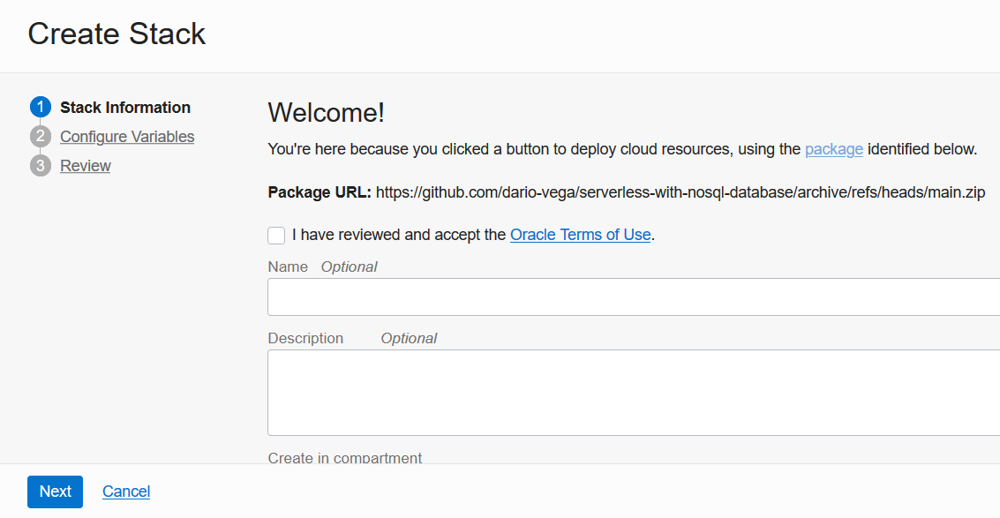

  Click on the box "I have reviewed and accept the Oracle Terms of Use."  After clicking this box, it will populate the stack information, the name and the description.  Check the 'Create in compartment' box and make sure it shows demonosql.   If it does not, change it to demonosql.  

4. Click on Next on bottom left of screen.  This will move you to the 'Configure Variables' screen. Configure the variables for the infrastructure resources that this stack needs prior to running the apply job.
Choose demonosql as _Compartment_  from the drop down list, provide your username in the text box _OCIR username_ then the token copied in step2 in the text box _OCIR user password_.  You can get your username from your profile.

    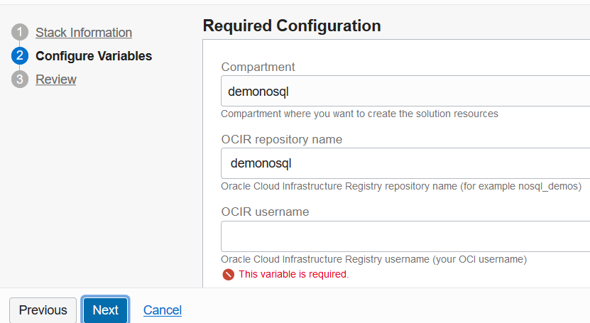

5. Click on Next, which brings you to the 'Review' screen.  Click on Create.

    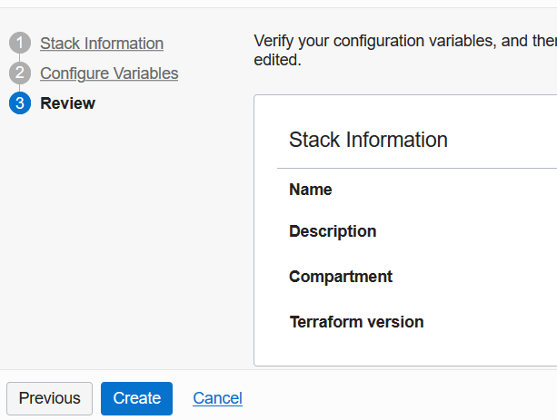

  A job will run automatically. It takes approx 3 minutes. Wait still "State" field becomes **Succeeded.**  While it is running you will see a new screen that has the status displayed.   

    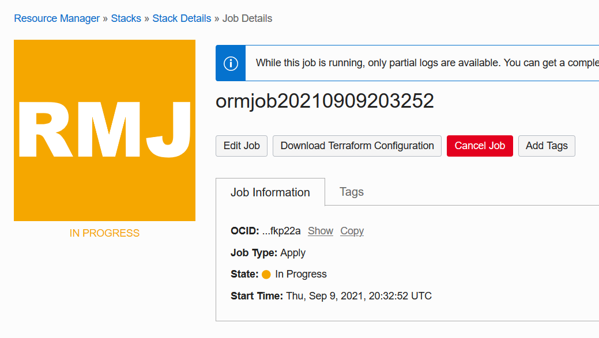

  Once it has succeeded you can delete that window from your browser.


## Task 4: Understand Credentials, Policies and the Dynamic Group

**Oracle NoSQL Database Cloud Service uses Oracle Cloud Infrastructure Identity and Access Management to provide secure access to Oracle Cloud.** Oracle Cloud Infrastructure Identity and Access Management enables you to create user accounts and give users permission to inspect, read, use, or manage tables.  Credentials are used for connecting your application to the service and are associated with a specific user.  The credentials consist of the tenancy ID, the user ID, an API signing key, a fingerprint and optionally a passphrase for the signing key.   These got created in Task 2 of this lab and are stored in the info.json file in your Cloud Shell.

The Oracle NoSQL Database SDKs allow you to provide the credentials to an application in multiple ways.  The SDKs support a configuration file as well as one or more interfaces that allow direct specification of the information. You can use the SignatureProvider API to supply your credentials to NoSQL Database.  Oracle NoSQL has SDKs in the following languages:  Java, Node.js, Python, Go, Spring and C#.

In this node.js snippet, we used the credential information created in Task 2 and specified the credentials directly as part of auth.iam property in the initial configuration .  

````
       return new NoSQLClient({
            region: Region.EU_FRANKFURT_1,
			compartment:'ocid1.compartment.oc1..aaaaaaaamg....y3hsyi57paa',
            auth: {
                iam: {
                    tenantId: 'ocid1.tenancy.oc1..aaaaaaaahrs4avamaxisc...........slpsdb2d2xe2kp2q',
                    userId: 'ocid1.user.oc1..aaaaaaaaq.......co3ssybmexcu4ba',
                    fingerprint: 'e1:4f:7f:e7:b5:7c:11:38:ed:e5:9f:6d:92:bb:ae:3d',
                    privateKeyFile: 'NoSQLprivateKey.pem'
                }
            }
        });
````

Another way to handle authentication is with Instance and Resource Principals.   The Oracle NoSQL SDKs support both of them.  As part of the stack deployment in Task 3, functions were setup for this workshop.  To enable a function to access another Oracle Cloud Infrastructure resource, you have to include the function in a **Dynamic group**, and then create a policy to grant the
dynamic group access to that resource.

Once the policy and the dynamic group are set up, you can include a call to a 'resource principal provider' in your function code. The resource principal provider uses a resource provider session token (RPST) that enables the function to authenticate itself with other Oracle Cloud Infrastructure services. The token is only valid for the resources to which the dynamic group has been granted access.

**Dynamic groups** allow you to group Oracle Cloud Infrastructure compute instances as "principal" actors (similar to user groups). You can then create policies to permit instances to make API calls against Oracle Cloud Infrastructure services. When you create a dynamic group, rather than adding members explicitly to the group, you instead define a set of matching rules to define the group members

As part of the stack deployment in Task 3, the necessary polices and dynamic groups got created on your behalf.  Now, you just use **Resource Principals** to do the connection to NoSQL Cloud Service as shown below in the Node.js and Python examples.

In this snippet, there are hard-coded references (eg REGION).

**NoSQL Database Node.js SDK**
```
function createClientResource() {
  return  new NoSQLClient({
    region: Region.EU_FRANKFURT_1,
    compartment:'ocid1.compartment.oc1..aaaaaaaafml3tc......jimgx3cdnirgup6rhptxwnandq',
    auth: {
        iam: {
            useResourcePrincipal: true
        }
    }
  });
}
```
**NoSQL Database Python SDK**
```
def get_handle():
     provider = borneo.iam.SignatureProvider.create_with_resource_principal()
     config = borneo.NoSQLHandleConfig('eu-frankfurt-1', provider).set_logger(None)
     return borneo.NoSQLHandle(config)
```

## Task 5: Set Up the Function Environment

Ensure your region is set to Phoenix.

1. Under the menu drop down on the upper left, go to Developer Services and then hit Applications under Functions.

    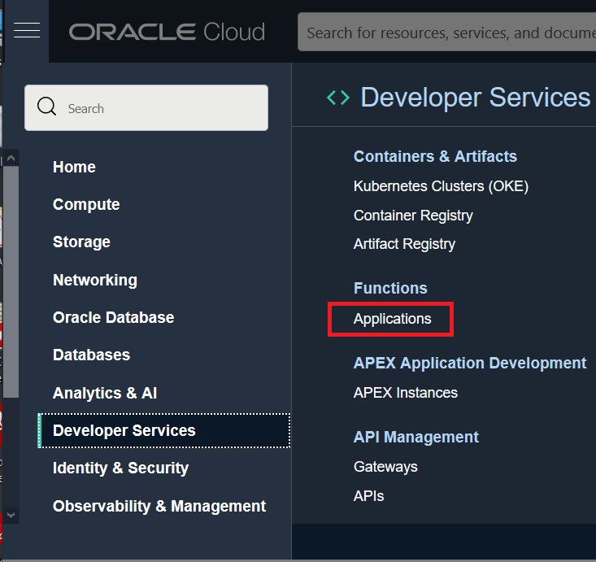

2. On the left under "List Scope",  Compartment field, select demonosql compartment

    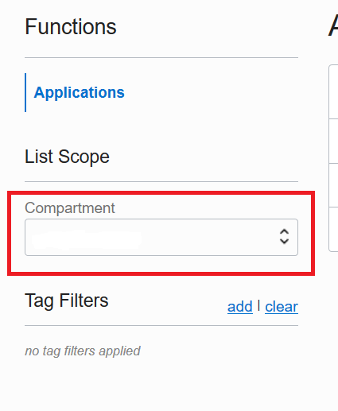

  Click on nosql_demos application

3. On the left choose Getting Started

    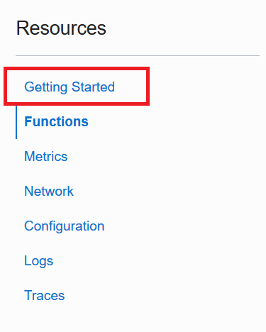

4. Click on Cloud Shell Setup. It may already be selected, look for the check mark in the box.

    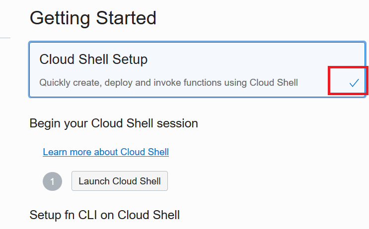

  Execute the steps 1 to 7 provided in this Wizard.  In these steps you will be cutting and pasting commands into the Cloud Shell.

  **Note:**

    -In step 4 replace [OCIR-REPO] by demonosql (the name of the compartment)

    -In step 5 you do not need to generate another authorization token.  Use the token generated in step 2 and copied down.

    -In step 6 it will ask for a password, paste in your auth token there.   The cursor may not move, so after you paste then hit enter.  It will say 'Login Succeeded' if it was successful.

You may now **proceed to the next lab.**

## Learn More

* [About Identity and Access Management](https://docs.oracle.com/en-us/iaas/Content/Identity/Concepts/overview.htm)
* [About Managing User Credentials](https://docs.oracle.com/en-us/iaas/Content/Identity/Tasks/managingcredentials.htm)
* [About Resource Manager](https://docs.oracle.com/en-us/iaas/Content/ResourceManager/Concepts/resourcemanager.htm)
* [About Networking](https://docs.oracle.com/en-us/iaas/Content/Network/Concepts/overview.htm)
* [About Cloud Shell](https://docs.oracle.com/en-us/iaas/Content/API/Concepts/cloudshellintro.htm)


## Acknowledgements
* **Author** - Dario Vega, Product Manager, NoSQL Product Management and Michael Brey, Director, NoSQL Product Development
* **Last Updated By/Date** - Michael Brey, Director, NoSQL Product Development, September 2021
